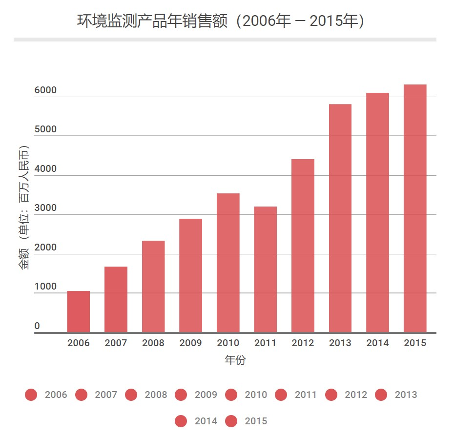
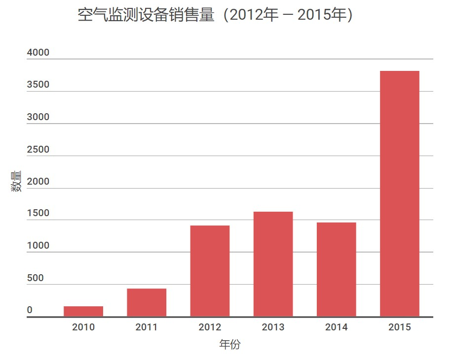

# 大气环境与空气健康领域政策进展和知识整理

<!-- START doctoc generated TOC please keep comment here to allow auto update -->
<!-- DON'T EDIT THIS SECTION, INSTEAD RE-RUN doctoc TO UPDATE -->

- [1.政策梳理](#1%E6%94%BF%E7%AD%96%E6%A2%B3%E7%90%86)
  - [1.1 国内大气环境政策发展概述（2017年以前）](#11-%E5%9B%BD%E5%86%85%E5%A4%A7%E6%B0%94%E7%8E%AF%E5%A2%83%E6%94%BF%E7%AD%96%E5%8F%91%E5%B1%95%E6%A6%82%E8%BF%B02017%E5%B9%B4%E4%BB%A5%E5%89%8D)
  - [1.2 国家环境保护环境与健康工作办法（试行）](#12-%E5%9B%BD%E5%AE%B6%E7%8E%AF%E5%A2%83%E4%BF%9D%E6%8A%A4%E7%8E%AF%E5%A2%83%E4%B8%8E%E5%81%A5%E5%BA%B7%E5%B7%A5%E4%BD%9C%E5%8A%9E%E6%B3%95%E8%AF%95%E8%A1%8C)
  - [1.3 首个大气VOCs在线监测指南在京发布](#13-%E9%A6%96%E4%B8%AA%E5%A4%A7%E6%B0%94vocs%E5%9C%A8%E7%BA%BF%E7%9B%91%E6%B5%8B%E6%8C%87%E5%8D%97%E5%9C%A8%E4%BA%AC%E5%8F%91%E5%B8%83)
  - [1.4 环保部等五部委《关于印发〈关于建立健全“十三五”生态环境保护规划实施机制的意见〉》](#14-%E7%8E%AF%E4%BF%9D%E9%83%A8%E7%AD%89%E4%BA%94%E9%83%A8%E5%A7%94%E5%85%B3%E4%BA%8E%E5%8D%B0%E5%8F%91%E5%85%B3%E4%BA%8E%E5%BB%BA%E7%AB%8B%E5%81%A5%E5%85%A8%E5%8D%81%E4%B8%89%E4%BA%94%E7%94%9F%E6%80%81%E7%8E%AF%E5%A2%83%E4%BF%9D%E6%8A%A4%E8%A7%84%E5%88%92%E5%AE%9E%E6%96%BD%E6%9C%BA%E5%88%B6%E7%9A%84%E6%84%8F%E8%A7%81)
  - [1.5 环保相关标准规范（18年2月5日补充，部分有重复）](#15-%E7%8E%AF%E4%BF%9D%E7%9B%B8%E5%85%B3%E6%A0%87%E5%87%86%E8%A7%84%E8%8C%8318%E5%B9%B42%E6%9C%885%E6%97%A5%E8%A1%A5%E5%85%85%E9%83%A8%E5%88%86%E6%9C%89%E9%87%8D%E5%A4%8D)
- [2.研究进展](#2%E7%A0%94%E7%A9%B6%E8%BF%9B%E5%B1%95)
  - [2.1 改善空气质量的中国模式:“大气十条”实施与评价  王金南/雷宇/宁淼](#21-%E6%94%B9%E5%96%84%E7%A9%BA%E6%B0%94%E8%B4%A8%E9%87%8F%E7%9A%84%E4%B8%AD%E5%9B%BD%E6%A8%A1%E5%BC%8F%E5%A4%A7%E6%B0%94%E5%8D%81%E6%9D%A1%E5%AE%9E%E6%96%BD%E4%B8%8E%E8%AF%84%E4%BB%B7--%E7%8E%8B%E9%87%91%E5%8D%97%E9%9B%B7%E5%AE%87%E5%AE%81%E6%B7%BC)
  - [2.2 刘建国：大气环境综合立体监测技术进展](#22-%E5%88%98%E5%BB%BA%E5%9B%BD%E5%A4%A7%E6%B0%94%E7%8E%AF%E5%A2%83%E7%BB%BC%E5%90%88%E7%AB%8B%E4%BD%93%E7%9B%91%E6%B5%8B%E6%8A%80%E6%9C%AF%E8%BF%9B%E5%B1%95)
- [3.会议动态](#3%E4%BC%9A%E8%AE%AE%E5%8A%A8%E6%80%81)
  - [3.1 “面向空气质量管理的新一代监测技术”国际研讨会](#31-%E9%9D%A2%E5%90%91%E7%A9%BA%E6%B0%94%E8%B4%A8%E9%87%8F%E7%AE%A1%E7%90%86%E7%9A%84%E6%96%B0%E4%B8%80%E4%BB%A3%E7%9B%91%E6%B5%8B%E6%8A%80%E6%9C%AF%E5%9B%BD%E9%99%85%E7%A0%94%E8%AE%A8%E4%BC%9A)
  - [3.2 空气污染治理已成巨大市场，第三届“创蓝”国际清洁空气大会聚焦行业热点](#32-%E7%A9%BA%E6%B0%94%E6%B1%A1%E6%9F%93%E6%B2%BB%E7%90%86%E5%B7%B2%E6%88%90%E5%B7%A8%E5%A4%A7%E5%B8%82%E5%9C%BA%E7%AC%AC%E4%B8%89%E5%B1%8A%E5%88%9B%E8%93%9D%E5%9B%BD%E9%99%85%E6%B8%85%E6%B4%81%E7%A9%BA%E6%B0%94%E5%A4%A7%E4%BC%9A%E8%81%9A%E7%84%A6%E8%A1%8C%E4%B8%9A%E7%83%AD%E7%82%B9)
  - [3.3 2017年国内国际双十大环境新闻发布暨中国环保产业发展论坛在北京举办](#33-2017%E5%B9%B4%E5%9B%BD%E5%86%85%E5%9B%BD%E9%99%85%E5%8F%8C%E5%8D%81%E5%A4%A7%E7%8E%AF%E5%A2%83%E6%96%B0%E9%97%BB%E5%8F%91%E5%B8%83%E6%9A%A8%E4%B8%AD%E5%9B%BD%E7%8E%AF%E4%BF%9D%E4%BA%A7%E4%B8%9A%E5%8F%91%E5%B1%95%E8%AE%BA%E5%9D%9B%E5%9C%A8%E5%8C%97%E4%BA%AC%E4%B8%BE%E5%8A%9E)
- [4.数据收集](#4%E6%95%B0%E6%8D%AE%E6%94%B6%E9%9B%86)
  - [4.1 污染防治行动计划](#41-%E6%B1%A1%E6%9F%93%E9%98%B2%E6%B2%BB%E8%A1%8C%E5%8A%A8%E8%AE%A1%E5%88%92)
  - [4.2 朝阳区将新增500个PM2.5监测子站 大气污染监控精细到“最后一公里”](#42-%E6%9C%9D%E9%98%B3%E5%8C%BA%E5%B0%86%E6%96%B0%E5%A2%9E500%E4%B8%AApm25%E7%9B%91%E6%B5%8B%E5%AD%90%E7%AB%99-%E5%A4%A7%E6%B0%94%E6%B1%A1%E6%9F%93%E7%9B%91%E6%8E%A7%E7%B2%BE%E7%BB%86%E5%88%B0%E6%9C%80%E5%90%8E%E4%B8%80%E5%85%AC%E9%87%8C)
  - [4.3 大气十条实施与评价：改善空气质量的中国模式](#43-%E5%A4%A7%E6%B0%94%E5%8D%81%E6%9D%A1%E5%AE%9E%E6%96%BD%E4%B8%8E%E8%AF%84%E4%BB%B7%E6%94%B9%E5%96%84%E7%A9%BA%E6%B0%94%E8%B4%A8%E9%87%8F%E7%9A%84%E4%B8%AD%E5%9B%BD%E6%A8%A1%E5%BC%8F)
  - [4.4 大气十条-产业结构和能源结构治理](#44-%E5%A4%A7%E6%B0%94%E5%8D%81%E6%9D%A1-%E4%BA%A7%E4%B8%9A%E7%BB%93%E6%9E%84%E5%92%8C%E8%83%BD%E6%BA%90%E7%BB%93%E6%9E%84%E6%B2%BB%E7%90%86)
  - [4.4 大气十条-重点行业减排治理](#44-%E5%A4%A7%E6%B0%94%E5%8D%81%E6%9D%A1-%E9%87%8D%E7%82%B9%E8%A1%8C%E4%B8%9A%E5%87%8F%E6%8E%92%E6%B2%BB%E7%90%86)
  - [4.5 大气十条-监测网络建设](#45-%E5%A4%A7%E6%B0%94%E5%8D%81%E6%9D%A1-%E7%9B%91%E6%B5%8B%E7%BD%91%E7%BB%9C%E5%BB%BA%E8%AE%BE)
- [5.知识点整理](#5%E7%9F%A5%E8%AF%86%E7%82%B9%E6%95%B4%E7%90%86)
  - [5.1 四梁八柱](#51-%E5%9B%9B%E6%A2%81%E5%85%AB%E6%9F%B1)
  - [5.2 “散乱污”企业](#52-%E6%95%A3%E4%B9%B1%E6%B1%A1%E4%BC%81%E4%B8%9A)

<!-- END doctoc generated TOC please keep comment here to allow auto update -->

## 1.政策梳理

### 1.1 国内大气环境政策发展概述（2017年以前）

随着环境监测业务的深入发展和环保形势的要求，传统环境监测领域暴露出监测能力不强、监测水平滞后、监测仪器老化等问题，这已成为制约环境监测发展的重要因素。随着“十二五”规划的顺利完成，我国环境监测领域迎来新一轮发展势头。2014、2015年也是“十三五”的布局之年，各种环保政策顶层设计陆续出台。

* 2014年4月24日，新修订的《环境保护法》颁布，并于次年1月起实施，带动了《大气污染防治行动计划》、《水污染防治行动计划》、《土壤环境保护和污染治理行动计划》三大行动计划。

* 2015年7月26日，国务院办公厅印发《生态环境监测网络建设方案》，该方案要求全面完善生态监测网络；全国联网，实现生态环境监测信息集成共享；自动预警，科学引导环境管理与风险防范；依法追责，建立生态环境监测与监管联动机制；健全生态环境监测制度与保障体系。主要目标是到2020年，初步建成陆海统筹、天地一体、上下协同、信息共享的生态环境监测网络，使生态环境监测能力与生态文明建设要求相适应。

* 2015年8月29日，经十二届全国人大常委会第十六次会议修订通过《中华人民共和国大气污染防治法》正式发布，并于次年1月起实施。这部被称作“史上最严”的《大气法》针对环境监测规定：国务院环境保护主管部门负责制定大气环境质量和大气污染源的监测和评价规范，组织建设与管理全国大气环境质量和大气污染源监测网，组织开展大气环境质量和大气污染源监测，同一发布全国大气环境质量状况信息。

* “十三五”以来，党中央、国务院高度重视环保产业发展及生态文明建设，提出了一系列关于生态文明建设的新理念、新思想、新战略，为推进生态文明建设提供了理论指导和行动指南；“十三五”规划的是个任务目标公布，首次将加强“生态文明建设（美丽中国）”写入五年规划，“节能环保”列为国家加快培育和发展的七大战略性新兴产业之一，并将生态环保作为服务、支撑、保障“一带一路”建设可持续推进的重要环节；近年来的相关政策出台力度前所未有，我国生态环境法治体系逐步健全、完善。

* 2016年1月1日，修订后的《中华人民共和国大气污染防治法》正式施行。新版大气法不仅提出要加强对燃煤、工业、机动车船、扬尘、农业等大气污染的综合防治，而且强化了地方政府在环境保护、改善大气质量方面的责任，加强了对地方政府的监督。

* 2016年3月3日，环保部将原污染防治司、污染物排放总量控制司等部门重组，设置水、大气、土壤三个环境管理司。这是贯彻落实中央关于加强生态环境保护、推进以改善环境质量为核心各项工作有效开展的重要举措。

* 2016年9月，环境保护部启动全国338个地级以上城市1436个国家环境空气自动站监测事权上收工作，并于2017年前如期完成了国家环境空气质量监测事权上收工作。

* 2016年11月7日，环境保护部公布《“十三五”环境监测质量管理工作方案》，这是环境监测行业纲领性的文件。改方案提出到2020年，我国要全面建成环境空气、地表水和土壤等环境监测质量控制体系。根据该方案，2016年底上收国家环境空气质量监测事权；2020年全面建成环境空气、地表水和土壤等环境监测质量控制体系。

* 2017年2月23日，环境保护部印发《国家环境保护“十三五”环境与健康工作规划》，提出建立环境与健康监测、调查和风险评估制度及标准体系，增强科技支撑能力，创新管理体制机制，提升环境决策水平，壮大工作队伍，推动公众积极参与并支持环境与健康工作。

* 2017年3月1日，环境保护部印发《国家环境空气质量监测网城市站运行管理实施细则（试行）》、《国家环境空气质量监测网城市站自动监测仪器关键技术参数管理规定（试行）》，以适应监测事权上收后环境监测管理的新要求，规范国家环境空气质量监测网城市站运行和维护，保障环境空气监测数据准确可靠。

* 2017年，印发《京津冀及周边地区2017—2018年秋冬季大气污染综合治理攻坚行动方案》及其6个配套方案。

### 1.2 国家环境保护环境与健康工作办法（试行）

>为加强环境健康风险管理，推动保障公众健康理念融入环境保护政策，指导和规范环境保护部门环境与健康工作，根据《中华人民共和国环境保护法》《“健康中国2030”规划纲要》等法律法规和政策，我部组织编制了《国家环境保护环境与健康工作办法(试行)》(见附件)。现印发给你们，请结合实际抓好落实。

2018年1月24日，环保部办公厅文件《国家环境保护环境与健康工作办法（试行）》。旨在加强环境健康风险管理，推动保障公众健康理念融入环境保护政策，指导和规范环境保护部门环境与健康工作。

[原文链接](http://huanbao.bjx.com.cn/news/20180130/877672.shtml)

### 1.3 首个大气VOCs在线监测指南在京发布

中国日报11月21日电，清洁空气联盟在北京发布中国首个《大气VOCs在线监测系统评估工作指南》（以下简称“《指南》”），是该领域首份框架性和指导性文件。这是基于目前上海、深圳等城市开展VOCs在线监测评估工作中的经验，形成了大气VOCs在线监测系统的评估框架和基础方法，以支持省市开展大气VOCs在线监测管理，完善城市大气VOCs监测的技术体系，同时促进该行业的规范化发展。

[原文链接](http://cn.chinadaily.com.cn/2017-11/21/content_34816230.htm)

### 1.4 环保部等五部委《关于印发〈关于建立健全“十三五”生态环境保护规划实施机制的意见〉》

近日，为贯彻国务院印发的《“十三五”生态环境保护规划》（以下简称“《规划》”），落实党的“十九大”提出的“推进绿色发展，着力解决突出环境问题，加大生态系统保护力度”等要求，环保部、国家发展改革委、农业部、水利部、国家林业局联合制定印发了《关于建立健全“十三五”生态环境保护规划实施机制的意见》。

[原文链接](http://www.lnepb.gov.cn/xxgkml/zfwj/lhh/201801/t20180112_103688.html)

### 1.5 环保相关标准规范（18年2月5日补充，部分有重复）

* 《国务院关于印发“十三五”生态环境保护规划的通知国发[2016]65号》
* 《国务院关于印发促进大数据发展行动纲要的通知国发〔2015〕50号》
* 《生态环境大数据建设总体方案》
* 《生态环境监测网络建设方案》（国办发[2015]56号）
* 《生态文明体制改革总体方案》
* 《关于支持环境监测体质改革的实施意见》（财建[2015]985号）
* 《关于省以下环保机构监测监察执法垂直管理制度改革试点工作的指导意见》（中办发〔2016〕63号）
* 《关于做好全国重点污染源监测数据管理与信息共享平台联网工作的通知》（2016待发稿）（环境保护部环境监测司）
* 《关于加强污染源监督性监测，强化监测与监察执法联动的实施意见》（征求意见稿） 《国务院办公厅关于进一步推进排污权有偿使用和交易试点工作的指导意见》国办发〔2014〕38号
* 《排污许可证管理暂行办法》
* 《污染源自动监控管理办法》（国家环保总局令第28号）
* 《企业事业单位环境信息公开办法》（环境保护部令第31号）
* 《国家重点监控企业自行监测及信息公开办法（试行）》（环发〔2013〕81号） 《水污染防治行动计划》（水十条）2015年
* 《大气污染防治行动计划》（气十条）2014年
* 《国务院关于印发“十三五”国家信息化规划的通知国发[2016]73号》
* 《2011年全国环境监察移动执法系统建设试点指导意见》（征求意见稿）
* 《先进的环境监测预警体系建设纲要（2010—2020年）》
* 《中华人民共和国环境影响评价法（主席令（第四十八号））》
* 《排污许可证管理暂行办法》
* 《中华人名共和国水污染防治法》
* 《中华人民共和国环境保护法》
* 《国务院关于加强环境保护重点工作的意见》（国发〔2011〕35号）
* 《国务院关于落实科学发展观加强环境保护的决定》（国发〔2005〕39号）
* 《关于全面加强环境信息基础能力规范化建设的意见》（环发[2010]87号）

电子政务信息化标准规范：

* 《“十三五”国家信息化规划》
* 《国家电子政务总体框架》
* 《国家信息化发展战略纲要》
* 《中国信息化发展报告（信息化白皮书）》
* 《关于进一步加强国家电子政务网络建设和应用工作的通知》（发改高技[2012]1986号） 《信息安全等级保护管理办法》（公通字[2007]43号）

## 2.研究进展
### 2.1 改善空气质量的中国模式:“大气十条”实施与评价  王金南/雷宇/宁淼

>摘要：目前,《大气污染防治行动计划》已圆满收官,无论是全国、74城市还是重点区域和北京,空气质量改善目标都超额完成了规定的任务。本文在回顾《大气污染防治行动计划》实施成效的基础上,总结了“凝聚合力、调整结构、突破重点、夯实法治、精细管理”的改善空气质量的中国模式，提出制定中长期行动纲要、建立长效体制机制、突出源头防控、科学管理大气质量等建议。 

[链接](http://kns.cnki.net/kcms/detail/11.1700.X.20180129.2134.040.html)

### 2.2 刘建国：大气环境综合立体监测技术进展

2017年4月7日，中国环境监测总站举办了国家环境保护环境监测质量控制重点实验室系列学术讲座的第三讲。刘建国研究员简述了环境监测技术的发展与现状。环境监测技术总体向更高精度、更多成分、更大尺度、更加适用和更加智能发展。未来10年大气科学研究将面临全球变化背景下高影响天气及其社会-经济影响、水循环过程模拟与预测、综合性温室气体信息系统、大气气溶胶对空气质量、天气以及气候的影响、面向超大城市及大规模城市综合体的大气科学研究与服务和相关技术发展对科学及其应用的影响等六大新挑战和机遇，超高分辨率建模的尖端数据同化技术和计算技术、实现大气组分近实时分析的自动检测平台、先进卫星观测站、地基遥感技术以及地球工程技术等新技术逐渐得到开发和应用。国际上发展了一系列机载、星载环境探测系统和载荷，得到了全球尺度的痕量污染气体、温室气体和PM2.5监测信息。我国在环境监测技术方面的国际竞争力相对较弱，国内企业尚未成为环境监测技术研发主体。我国的环境监测仪器产业技术发展战略中规划：到2020年，完成我国区域环境污染综合立体监测网络；到2025年，实现机载、星载大气环境污染业务化监测；到2035年，实现生态环境的智能化、立体化综合关联监测。

[链接](http://www.chinacace.org/news/view?id=8211)

## 3.会议动态

### 3.1 “面向空气质量管理的新一代监测技术”国际研讨会

北京市环境保护监测中心报道，2017年6月15日前后，“面向空气质量管理的新一代监测技术”国际研讨会在北京召开，由市环保局、监测中心、法国巴黎大区空气质量管理中心和大气颗粒物监测技术北京市重点实验室共同主办。来自北京、加州、纽约、伦敦、巴黎、米兰、东京、首尔、莫斯科和墨西哥城等世界大城市的专家、京津冀晋鲁蒙豫以及北京市市区两级环保系统的监测技术人员参加了会议。

会上，来自外方科研机构、应用机构和人工智能研究领域的专家，分别介绍了欧盟、意大利、美国、法国和挪威在便携式大气环境监测小型传感器领域所取得的进展和突破，监测中心介绍了北京市基于传感器的PM2.5高密度监网的建立和应用情况，以及北京市传感器监测网质控工作中采用的云计算和物联网技术。双方对各自存在的问题进行了分析。在随后的讨论环节中，在场嘉宾针对小型传感器的应用前景、技术难点以及在面对公众服务方面的挑战等议题发表了意见和建议。

本次国际研讨会，监测中心与发达国家和地区，通过对新型监测技术进行深入的探讨交流，为下一步继续加强各技术领域的研究提供了思路和方向。

### 3.2 空气污染治理已成巨大市场，第三届“创蓝”国际清洁空气大会聚焦行业热点

空气质量是关乎民生的重要问题，随着近年来我国对大气污染治理的日益重视，越来越多的优秀清洁空气技术也不断涌现，有效改善了空气质量。2017年12月14-15日，由清洁空气联盟主办的第三届“创蓝”国际清洁空气大会在京举行，汇聚了国内外专家、技术企业、投资机构、环保部门等400多人共同深入探讨行业热点，大会同时发布了第三届“创蓝奖“的评选结果。

[原文链接](http://www.cleanairchina.org/product/9077.html)

### 3.3 2017年国内国际双十大环境新闻发布暨中国环保产业发展论坛在北京举办

2018年1月27日上午9点，由环保部主管单位中国环境报主办，泛测（北京）环境科技有限公司协办的“2017年国内国际双十大环境新闻发布暨中国环保产业发展论坛”在北京召开。论坛荟聚重量级嘉宾，来自环境保护部门、环境治理企业、工业企业代表,及金融界人士、媒体共计120余人出席会议，集中探讨新时代环保产业发展。

[原文链接](http://www.instrument.com.cn/netshow/SH104036/news_239148.htm)

## 4.数据收集

### 4.1 污染防治行动计划

全面落实大气、水、土壤污染防治三大行动计划，推动实施一批环境基础设施建设和环境综合整治项目。全国燃煤机组累计完成超低排放改造约6.4亿千瓦，占煤电总装机容量的68%，改造电厂煤耗达世界先进水平。全面实施第五阶段机动车排放标准和清洁油品标准，2014—2016年累计淘汰黄标车和老旧车1620多万辆。10.8万个村庄开展农村环境综合整治，1.9亿农村人口受益。2016年，京津冀、长三角、珠三角三个区域细颗粒物（PM2.5）平均浓度与2013年相比都下降30%以上。全国酸雨面积占国土面积比例由历史高点的30%左右下降到7.2%。地表水国控断面I－III类水体比例增加到67.8%，劣V类水体比例下降到8.6%，大江大河干流水质稳步改善。

### 4.2 朝阳区将新增500个PM2.5监测子站 大气污染监控精细到“最后一公里”

记者从朝阳区“两会”了解到，2018年，朝阳区将新增500个PM2.5监测子站，覆盖43个街乡，把大气污染监控精细到“最后一公里”。此外，还将进一步加大对机动车排放的管理工作，在辖区内京承、京哈、京沪高速道路收费站进京方向设立柴油货车专用检查通道，新增2台移动式遥感检测车，并在广渠路、东坝南二街等新增4处固定式遥感检测设备。

[原文链接](http://beijing.qianlong.com/2018/0111/2320898.shtml)

### 4.3 大气十条实施与评价：改善空气质量的中国模式

* 全国环境空气质量总体明显改善。自2013年实施“大气十条”以来，全国338个地级及以上城市可吸入颗粒物（PM10）、二氧化硫（SO2）、二氧化氮（NO2）年均浓度分别下降16%、47%、3%，达到81微克/立方米、19微克/立方米、31微克/立方米。酸雨区面积占国土面积的比例由2013年的10.6%下降至2016年的7.2%，酸雨污染程度已降低到20世纪90年代水平。相比2013年，2017年全国首批实施新环境空气质量标准的74个城市（以下简称“74个城市”）优良天数比例上升12个百分点，达到73%；重污染天数比例下降5.7个百分点，达到3%。

* 重点区域环境空气质量改善尤为突出。相比2013年，2017年京津冀、长三角和珠三角区域PM2.5年均浓度平均下降39%、34%和26%，分别达到64微克/立方米、44微克/立方米和35微克/立方米；京津冀区域PM2.5年均浓度下降尤为明显，其下降比例为74个城市平均水平的1.14倍（见图1）。此外，京津冀及周边地区、长三角和珠三角区域PM10年均浓度平均分别下降19%、28%和22%，为全国平均水平的1.24倍、1.79倍和1.40倍；SO2年均浓度平均分别下降51%、54%和48%，为全国平均水平的1.08倍、1.15倍和1.02倍；NO2年均浓度平均分别下降4%、10%和8%，为全国平均水平的1.36倍、3.22倍、2.63倍。相比2013年，京津冀、长三角、珠三角区域优良天数比例分别增加19个百分点、11个百分点和8个百分点，京津冀区域优良天数比例增幅达到74个城市平均水平的1.52倍（见图2）；京津冀区域重污染天数比例由2013年的21%降低至2017年的8%左右（见图3），向中长期基本消除重污染天气迈出坚实的一步。

* “大气十条”规定的环境空气质量目标任务超额完成。“大气十条”设定的空气质量改善目标：“到2017年，全国地级及以上城市可吸入颗粒物浓度下降10%以上，优良天数逐年提高；京津冀、长三角、珠三角等区域细颗粒物浓度分别下降25%、20%、15%左右，其中北京市细颗粒物年均浓度控制在60微克/立方米左右”均超额完成。考核PM2.5的10省份及广东省珠三角区域，北京、天津、河北、山东、上海、江苏、浙江、重庆8省（市）PM2.5年均浓度下降比例均超过30%；考核PM10的省份中，贵州、福建、青海、湖南等省份PM10年均浓度下降比例达到20%以上。特别是全世界关注的北京市，2017年PM2.5年均浓度达到58微克/立方米。由此可见，无论是全国和74城市，还是重点区域和北京，空气质量改善目标都已经或超额完成规定的目标，为“打赢蓝天保卫战”奠定了基础。

来源：《“大气十条”实施与评价：改善空气质量的中国模式》

### 4.4 大气十条-产业结构和能源结构治理

治理大气污染重在改变生产方式和生活方式。“大气十条”在推动形成绿色发展方式和生活方式、构建大气污染源头防控体系方面进行了积极尝试。一是加快产业结构调整，积极化解钢铁、煤炭过剩产能，淘汰重点行业落后产能。2013—2016年，累计淘汰落后炼钢炼铁产能1亿吨、水泥2.3亿吨、平板玻璃1.1亿重量箱、电解铝130多万吨；铁腕整治“散乱污”工业企业，对“2＋26”城市内相关企业开展拉网式排查，排查出主要涉气“散乱污”企业6.2万家、燃煤小锅炉5.5万台，对发现的问题企业，及时清理整顿。二是大力提高能源利用效率和煤炭质量，2013—2016年，全国单位GDP能耗累计降低约14.4%，累计节能约8.5亿吨标准煤；出台《商品煤质量管理暂行办法》，提高商品煤质量和利用效率。三是积极优化能源结构，推进煤炭消费减量替代。全国煤炭消费总量一改10年间翻一番的快速增长态势，从2013年后开始下降，从2013年的42亿吨下降至2016年的38亿吨，煤炭占一次能源消费的比重相应由67.4%下降至62%；水电、风电、核电、太阳能等清洁能源供应不断增加，占一次能源比重从2013年的15.5%提高到2016年的19.7%，相当于减少煤炭燃用2.4亿吨，减排二氧化碳5亿吨，为改善空气质量、应对全球气候变化作出突出贡献。

2017年，以“2＋26”城市冬季清洁取暖为切入点，我国能源结构调整优化进程进一步加快。截至2017年底，“2＋26”城市共完成474万户“煤改气”和“煤改电”（以下简称“双替代”）。京津冀地区清洁取暖工作取得成效最为显著，共完成“双替代”任务324万户，占68%，约减少散煤消费800万吨左右，分别减少SO2、NOx、PM10、PM2.5的排放量5.95万吨、1.23万吨、10.92万吨、8.74万吨。根据测算模拟发现，“双替代”可使京津冀区域PM2.5年均浓度至少下降2.3微克/立方米。

参考：《“大气十条”实施与评价：改善空气质量的中国模式》

### 4.5 大气十条-重点行业减排治理

集中力量在重点领域、重点行业推进重大减排工程项目建设，是我国大气污染防治的另一鲜明特点。自2005年我国针对主要大气污染物排放实施总量控制以来，即开始在全国大规模推进减排工程建设，到目前为止，我国已建成全球最大的清洁高效煤电体系，燃煤脱硫机组装机容量即占到煤电总装机总量的99%以上、脱硝机组装机容量占火电总装机的92%以上。2015年以来，开始大规模推进煤电机组超低排放改造，改造后燃煤电厂的SO2、NOx和烟尘排放限值分别比国家排放标准降低83%、50%和67%，达到天然气电厂排放水平；目前全国超过半数的燃煤机组已完成超低排放的改造，京津冀区域已完成全部燃煤机组的超低排放改造。其他重点行业也实施了大规模减排工程，其中脱硫烧结机面积达到烧结机总面积的88%以上、脱硝水泥熟料产能占总产能的92%以上、脱硝平板玻璃生产线占总产能的57%以上，钢铁、水泥、平板玻璃的提标改造使其排污强度比2012年下降30%以上。10205家国家重点监控企业已全部安装在线监控，并与环境保护部联网，实现24小时实时监管。

“大气十条”还打响了针对移动源和面源的治理攻坚战。在移动源方面，全面加强机动车污染防治，加快淘汰黄标车和老旧车，2014—2016年累计淘汰1713万辆；推广应用新能源车辆，实施免征新能源汽车车辆购置税政策，2016年共生产51.7万辆新能源车，同比增长51.7%；实施国五机动车排放标准和清洁油品标准，发布国六车用油品标准和轻型汽车排放标准；开展船舶与港口污染控制，自2017年4月底起，天津港不再接收公路运输煤炭。基本完成加油站、储油库、油罐车油气回收治理。在面源方面，加快燃煤小锅炉整治，划定高污染燃料禁燃区，淘汰城市建成区10蒸吨以下小锅炉20余万台。

参考：《“大气十条”实施与评价：改善空气质量的中国模式》

### 4.6 大气十条-监测网络建设

着力提升大气环境管理能力，实施“问题诊断—来源解析—对策制定—科学评估”全流程精细化管理，针对重点地区、重点污染源、重点污染时段实施精确打击，保障“大气十条”空气质量改善效果。建成国家环境空气质量监测网，1436个国控监测站点全部具备PM2.5等六项指标监测能力，覆盖全国338个地级及以上城市；各地建设省控、市控监测点位3500多个；实时提供环境空气质量监测信息。推进污染来源解析，重点城市试点开展颗粒物来源解析业务化工作。针对重点污染时段出台强化控制措施，整个采暖季期间，京津冀大气污染传输通道“2＋26”城市钢铁、焦化、铸造、建材、有色、化工等多个产能过剩、污染排放突出行业实施错峰生产。建立涵盖“预测预报—决策会商—预警发布—应急响应—跟踪评估—预案修订”的重污染天气应对技术体系；强化预测预报能力建设，形成覆盖区域、省、市三级空气重污染监测预警能力，实现空气质量指数（AQI）3天精准预报和7天潜势分析；统一预警分级标准，明确不同预警级别污染物减排比例，细化应急减排措施；建立重污染天气联合应对工作机制，在秋冬季重污染应对中有效降低了污染峰值浓度。委托中国工程院等第三方开展“大气十条”中期实施进展的科学评估，及时查找“大气十条”实施过程存在的问题，提出后期调整改进的对策建议，为“大气十条”目标最终顺利完成提供了强有力支撑。

参考：《“大气十条”实施与评价：改善空气质量的中国模式》

### 4.7 环境监测渐成MEMS传感器发展新趋势

“环保热”的到来使得环境监测仪器行业异军突起。据国家统计局给出的资料显示，中国环境监测仪器行业的销售收入逐年增加，由2005年的15.84亿元上升至2015年的227.74亿元，预计2020年将达到950亿元。国内外传感器企业纷纷进军环保领域，千亿级市场即将全面爆发。纵观环境监测仪器行业，环境传感器因其便携、智能、多样化等特性而受到大众青睐。它能够让我们感知周围的环境，实现对气压、温度、湿度、空气质量等数据的实时检测，进而应用于社会、公共事业、智慧工厂、家居安全与健康、[机器人](http://www.eefocus.com/article/tag/%E6%9C%BA%E5%99%A8%E4%BA%BA)等领域。环境监测技术升级加上国家对环境检测行业的政策倾斜和资金投入加大，以及整个社会对环境问题的关注度提升，环境监测仪器行业将延续景气，环境监测将成为下一波MEMS传感器发展的一大重要方向。

[原文链接](http://www.eefocus.com/sensor/380282)

受政策的驱动，2006年-2015年间，环境监测设备销售增长了6倍（参见图1）。在中国很有可能会继续加强环境治理的情况下，绿色科技将在未来几年成为环境产业的摇钱树。

[原文链接](https://www.chinadialogue.net/article/show/single/ch/9791-Green-tech-is-China-s-gold-mine-)

## 5.知识点整理

### 5.1 四梁八柱

“四梁八柱”论，就是以习近平同志为核心的党中央提出的一种改革思维、改革方法论。

这种改革思维，首先要求的是大局观。如果不熟悉中国政治和中国社会，任意切进当下中国的任何一个面向，很有可能陷入盲人摸象般的困局，而这也是西方媒体，或者说，抱有非黑即白意识形态二分法论的人们在观察和解释中国时常会陷入的境地。从东部沿海到西部内陆，中国发展的差异性是显著的。而在改革的各个领域，难易程度也是不一样的。

其次，要求的是“优先排序”。什么事情应该提前做、抓紧做、重点做，对中国来说需要仔细甄别。这就像是一个人开始每一天的工作，总要条理清晰地进行工作安排。党中央的英明之处，用习近平在中央深改组第二十次会议上的话说，就是“把各领域具有四梁八柱性质的改革明确标注出来，排出优先顺序，重点推进，发挥好支撑作用。特别是要把国有企业、财税金融、科技创新、土地制度、对外开放、文化教育、司法公正、环境保护、养老就业、医药卫生、党建纪检等领域具有牵引作用的改革牢牢抓在手上”。

再次，要求的是“踏石留印，抓铁有痕”。排出优先顺序之后则需要更加对症下药。稳扎稳打推进，每一步都有精心的政治考量、全局考量。

基础不牢，地动山摇。2017年的新年贺词中，习近平信心满满地说，“各领域具有四梁八柱性质的改革主体框架已经基本确立”。通晓中国传统建筑的人会知道，四梁八柱搭起，屋子就已成形，可以进一步完善了。也许房子建成后梁柱看起来没有雕花精美，不如屏风秀气，但梁柱才是支撑大厦的根本。强基固本，搭好平台，给后面的建筑以基础、以支撑，这就是中国改革的逻辑。

[原文链接](http://theory.people.com.cn/n1/2017/0329/c40531-29176299.html)

### 5.2 “散乱污”企业

根据《京津冀及周边地区2017年大气污染防治工作方案》，“散乱污”企业主要是有色金属熔炼加工厂、橡胶生产、制革、陶瓷烧制、铸造、丝网加工、轧钢、耐火材料、炭素生产、石灰窑、砖瓦窑、水泥粉磨站、废塑料加工，以及涉及涂料、油墨、胶黏剂、有机溶剂等使用的印刷、家具等不达标、无组织排放、废水超标的小型制造加工企业。

来源：《打赢蓝天保卫战 | 2017北京环保重举盘点之打散治污》，京环之声

